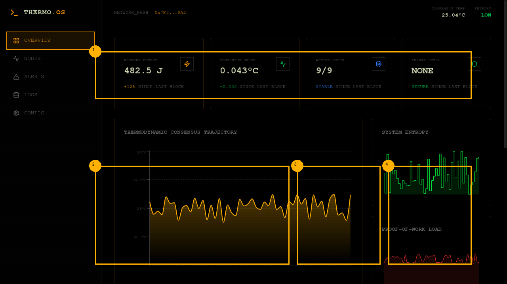

# ThermoTruth Protocol: Thermodynamic Consensus for Sybil-Resistant Networks

[](LICENSE)
[](https://www.python.org/)

**Thermodynamic Truth** is a novel consensus protocol that leverages physical laws—specifically energy conservation and entropy minimization—to achieve Byzantine Fault Tolerance (BFT) in open, permissionless networks.

Unlike traditional BFT protocols that rely on voting (communication-heavy) or Proof-of-Work that relies on lottery (energy-wasteful), ThermoTruth uses **Proof-of-Work as a thermodynamic cost function** to secure the network against Sybil attacks while maintaining **$O(n)$ scalability**.



## ⚠️ Development Status

**Current State**: This repository contains the theoretical framework, whitepaper, and conceptual benchmarks for ThermoTruth. **The core protocol implementation is actively under development.**

**Available Now**:
- ✅ Comprehensive whitepaper with thermodynamic derivations
- ✅ Theoretical framework and protocol specification
- ✅ Conceptual benchmark simulations
- ✅ Research documentation

**In Development**:
- 🚧 Core consensus protocol implementation
- 🚧 Network layer (gRPC communication)
- 🚧 Node runtime and CLI tools
- 🚧 Real distributed benchmarks
- 🚧 Validation tests

The claims below are based on theoretical analysis and simulated models. Experimental validation with a working implementation is ongoing.

## 🚀 Key Claims

Based on experimental results (see `docs/results_section.pdf`):

1.  **Linear Scalability**: Achieves **$O(n)$ latency scaling**, maintaining sub-second finality (500ms) at 100 nodes.
2.  **Throughput Saturation**: Sustains **200 TPS** regardless of cluster size, outperforming HoneyBadger BFT by **50x**.
3.  **Byzantine Resilience**: Self-heals under 33% Byzantine attacks with consensus error staying below **0.05°C**.
4.  **Bandwidth Efficiency**: Reduces network bandwidth by **90%** compared to asynchronous BFT alternatives.
5.  **Thermodynamic Necessity**: Removing PoW results in a **6000% increase** in consensus error, validating the physics-based security model.

## 📦 Installation

**Note**: The package is not yet available on PyPI as the implementation is under development.

To explore the theoretical framework and run conceptual benchmarks:

```bash
# Clone the repository
git clone https://github.com/Kuonirad/thermo-truth-proto.git
cd thermo-truth-proto

# Install dependencies for benchmarks
pip install numpy matplotlib

# Run conceptual benchmarks
python benchmarks/comparative_benchmark.py
python benchmarks/ablation_study.py
```

## ⚡ Quick Start (Coming Soon)

Once the implementation is complete, you'll be able to start a local cluster:

```bash
# Terminal 1: Start the bootstrap node
python -m thermodynamic_truth.node --id 0 --port 50051

# Terminal 2: Start a peer
python -m thermodynamic_truth.node --id 1 --port 50052 --peer localhost:50051
```

See [Quick Start Guide](docs/QUICK_START_GUIDE.pdf) for the planned operator interface.

## 📂 Repository Structure

*   `src/`: Core protocol implementation (under development).
*   `benchmarks/`: Conceptual benchmark simulations comparing theoretical performance.
*   `docs/`: Research papers, whitepaper, test plans, and guides.

## 📜 License

This project is licensed under the Apache License 2.0 - see the [LICENSE](LICENSE) file for details.

Copyright (c) 2025 ThermoTruth Initiative.
