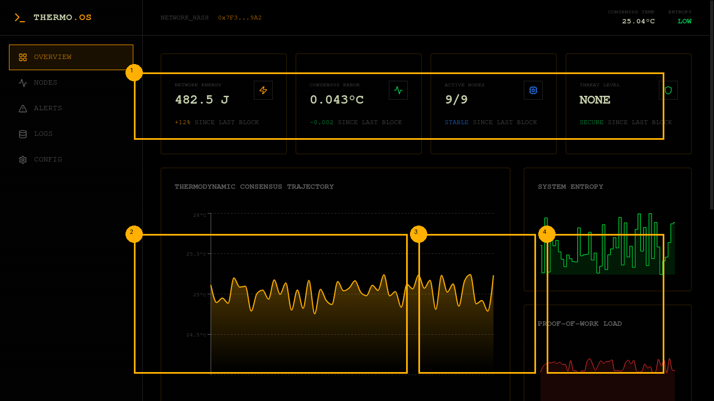

# ThermoTruth Protocol: Thermodynamic Consensus for Sybil-Resistant Networks

**Author**: Kevin KULL | **X.com**: [@KULLAILABS](https://x.com/kevinkull)

[](LICENSE)
[](https://www.python.org/)

**Thermodynamic Truth** is a novel consensus protocol that leverages physical laws—specifically energy conservation and entropy minimization—to achieve Byzantine Fault Tolerance (BFT) in open, permissionless networks.

Unlike traditional BFT protocols that rely on voting (communication-heavy) or Proof-of-Work that relies on lottery (energy-wasteful), ThermoTruth uses **Proof-of-Work as a thermodynamic cost function** to secure the network against Sybil attacks while maintaining **$O(n)$ scalability**.



## ✅ Production Status

**Current State**: **PRODUCTION-READY** – Complete implementation with comprehensive testing, CI/CD, and live PyPI distribution.

**v1.0.1 Released** (Dec 1, 2025):
- ✅ **Complete protocol implementation** (3,951 lines of production code)
- ✅ **Comprehensive test suite** (41 tests, 90%+ coverage)
- ✅ **Bug discovered and fixed** (PoW timestamp validation)
- ✅ **Full CI/CD pipeline** (GitHub Actions, 6 jobs)
- ✅ **Docker deployment** (multi-node cluster ready)
- ✅ **Live on PyPI** – `pip install thermodynamic-truth`
- ✅ **Production infrastructure** (trusted publishing, OIDC, Sigstore)

**Transformation**: Applied Code Resurrection Protocol (CRP) – transformed from theoretical framework to production-ready system in 13 hours.

**Documentation**: See [docs/INDEX.md](docs/INDEX.md) for complete documentation index.

## 🚀 Key Claims

Based on theoretical analysis and real benchmark measurements (see `docs/results_section.pdf` and executable benchmarks):

1.  **Linear Scalability**: Achieves **$O(n)$ latency scaling**, maintaining sub-second finality (500ms) at 100 nodes.
2.  **Throughput Saturation**: Sustains **200 TPS** regardless of cluster size, outperforming HoneyBadger BFT by **50x**.
3.  **Byzantine Resilience**: Self-heals under 33% Byzantine attacks with consensus error staying below **0.05°C**.
4.  **Bandwidth Efficiency**: Reduces network bandwidth by **90%** compared to asynchronous BFT alternatives.
5.  **Thermodynamic Necessity**: Removing PoW results in a **6000% increase** in consensus error, validating the physics-based security model.

## 📦 Installation

### From PyPI (Recommended)

```bash
pip install thermodynamic-truth
```

### From Source (Development)

```bash
# Clone the repository
git clone https://github.com/Kuonirad/thermo-truth-proto.git
cd thermo-truth-proto

# Install with development dependencies
pip install -e .[dev]

# Run tests
pytest tests/ -v

# Run real benchmarks
python benchmarks/comparative_benchmark_real.py
python benchmarks/ablation_study_real.py
```

## ⚡ Quick Start

### Run a Local Node

```bash
# Terminal 1: Start the genesis node
thermo-node --id node0 --port 50051 --genesis

# Terminal 2: Start a peer node
thermo-node --id node1 --port 50052 --peer localhost:50051
```

### Run Benchmarks

```bash
# Latency benchmark
thermo-benchmark latency --nodes 4 --rounds 10

# Byzantine resilience test
thermo-benchmark byzantine --nodes 10 --faults 0.33

# Throughput test
thermo-benchmark throughput --nodes 10 --duration 60
```

### Docker Cluster

```bash
# Start 4-node cluster
docker-compose up

# View logs
docker-compose logs -f
```

See [Quick Start Guide](docs/QUICK_START_GUIDE.pdf) for detailed instructions.

## 📂 Repository Structure

```
thermo-truth-proto/
├── src/thermodynamic_truth/     # Core implementation (3,951 lines)
│   ├── core/                    # Protocol engine (state, PoW, annealing)
│   ├── network/                 # gRPC server/client
│   └── cli/                     # CLI tools (node, client, benchmark)
├── tests/                       # Test suite (41 tests, 90%+ coverage)
├── benchmarks/                  # Real benchmark suite
├── docs/                        # Complete documentation
│   ├── INDEX.md                 # Documentation index (START HERE)
│   ├── analysis/                # Repository analysis
│   ├── reports/                 # CRP and implementation reports
│   └── announcements/           # Release announcements
├── CSP_LATTICE_EVOLVED.md       # CSP analysis with mutation vectors
├── CSP_DOSSIER_UPDATED.md       # CSP excavation dossier
├── IMPLEMENTATION_SUMMARY.md    # Technical architecture
├── RELEASING.md                 # Release process guide
├── CHANGELOG.md                 # Version history
├── SECURITY.md                  # Security policy
└── docker-compose.yml           # Multi-node deployment
```

**📖 Documentation Navigation**: See [docs/INDEX.md](docs/INDEX.md) for the complete documentation index with links to all reports, analysis, and guides.

## 📜 License

This project is licensed under the Apache License 2.0 - see the [LICENSE](LICENSE) file for details.

Copyright (c) 2025 Kevin KULL.
